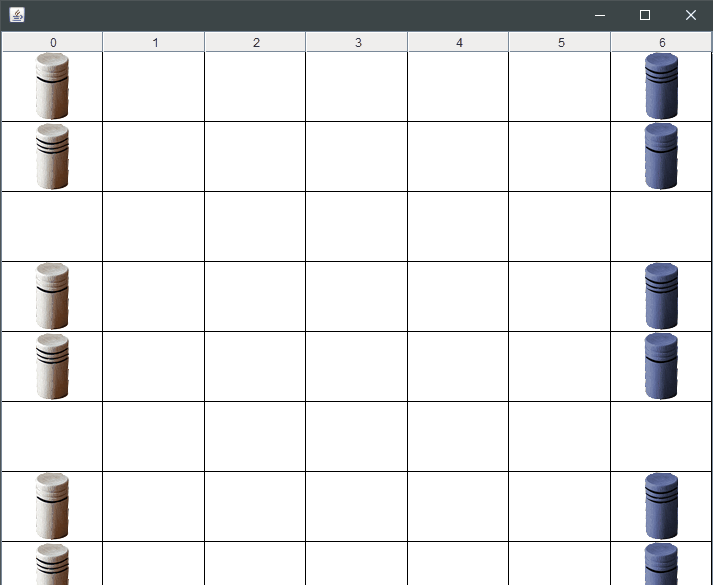

# dut.Arcanor
"A virtual board game made with java."  
I had to reproduce with one of my classmate a board game named "Arcanor". I first learnt the rules, and then I made several diagrams to develop it after. Working with my teammate, I spent hours programming it and it was finally done. The game is playable by command line.  
[About Arcanor](https://www.merouxmodelkit.fr/Ludo_regles/065.pdf)

# Run

1. Run  *Arcanor_launcher.bat*  or  *Arcanor_modeTexte.bat*  
2. Follow the instructions !

# Notes

- The saves are in the directory *data/parties/* 
- To read the rules of the game, choose the option "3" at the start
- **Careful** : in graphic mode, resize the window to display the grid

# Preview
 

# Made by

Bardaine Cédric & S. A. 